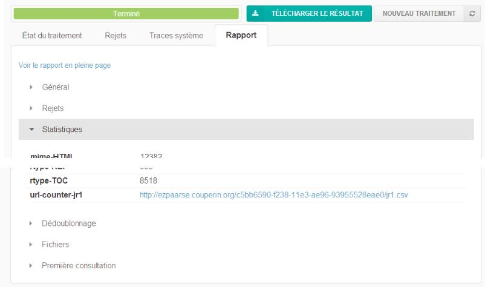
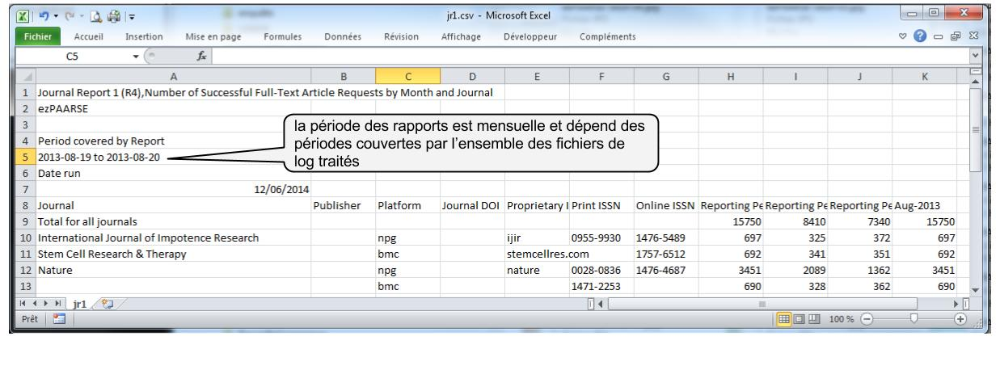

### Rapports COUNTER ###

Il est possible de demander à ezPAARSE la génération de rapports COUNTER à partir des données à traiter dans les fichiers de log.
Il suffit pour cela d'ajouter dans la requête le paramètre **COUNTER-Reports** en précisant le type de rapport (actuellement seul JR1 est disponible) avec éventuellement un format dans le paramètre **COUNTER-Format**.


#### Paramètres (headers) ####

-   **COUNTER-Reports:** liste des rapports COUNTER à générer (ex: JR1,BR2). Les liens de téléchargement sont accessibles dans la section `stats` du raport de traitement.
-   **COUNTER-Format:** format des rapports COUNTER : `XML` (par défaut) ou `TSV`.  
-   **COUNTER-Customer:** nom et/ou email du client à renseigner dans les rapports, sous la forme `nom`, `<email>` ou `nom<email>`. (Par défaut `ezPAARSE<mail de l'administrateur>`)  
-   **COUNTER-Vendor:** nom et/ou email de l'éditeur à renseigner dans les rapports, sous la forme `nom`, `<email>` ou `nom<email>`. (Par défaut `platform42`, sans mail)  

#### Usage en mode commande ####

Exemple d'usage :
```shell
curl -X POST http://localhost:59599 \
 -H "Accept:text/csv" \
 -H "Traces-Level:info" \
 -H "COUNTER-Reports:JR1" \
 -H "COUNTER-Format:csv" \
 -F "files[]=@fede.bibliovie.ezproxy.2014.06.10.log.gz;type=application/x-gzip"```

En mode commande avec cURL, le rapport généré peut être téléchargé à l'adresse renvoyée dans le header **Job-Report-jr1** (comme ci-dessous) ou dans la section statistiques du rapport de traitement avec le contenu du champ **url-counter-jr1** (voir plus bas) :


#### Usage via le formulaire ####

La génération de rapports COUNTER peut être demandée via l'onglet **Paramètres** du formulaire de traitement de log, en complètant la section **Headers (avancé)** et en ajoutant les headers relatifs à COUNTER comme ci-dessous :


A la fin du traitement le(s) rapport(s) COUNTER peut être téléchargé via le(s) lien(s) présent dans le rapport du traitement à la section **statistiques** dans le champ **url-counter-jr1**



#### Rapport COUNTER ####

Selon le format de sortie demandée, le(s) rapport(s) COUNTER peut être chargé dans un tableur. Ci-dessous, un fichier CSV importé dans excel.



