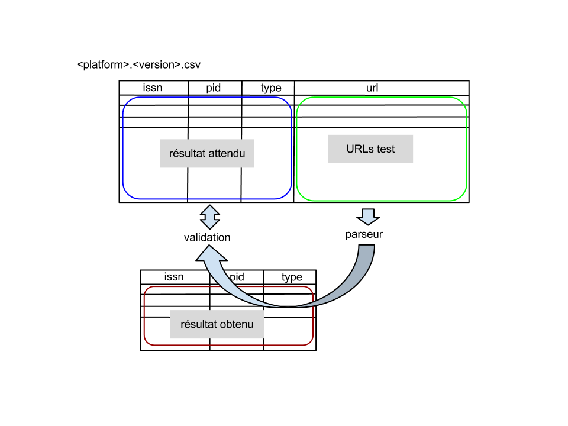
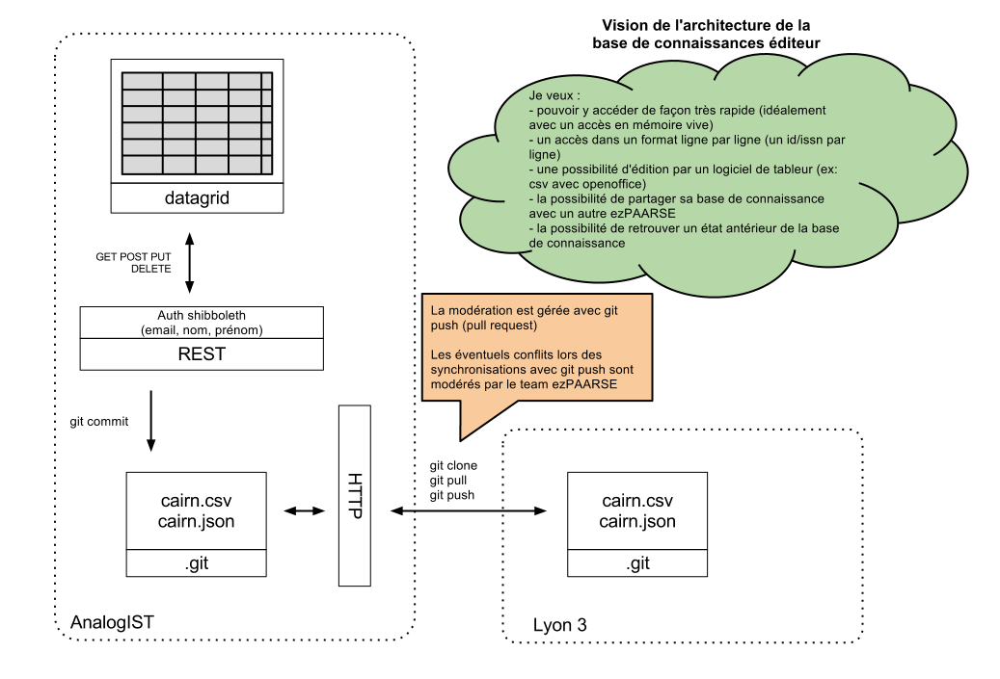

# Documentation développeur #

## Technologies utilisées par ezPAARSE ##

* [nodejs](http://nodejs.org/) pour le coeur d'ezPAARSE (performances et sa gestion avancée du streaming).
* [git](http://git-scm.com/) pour gérer les bases de connaissances éditeurs et le code source.
* [php](http://php.net), [perl](http://www.perl.org/), [python](http://www.python.org/) ou autres langages pour l'écriture des parseurs.

## Guide rapide d'utilisation de git ##

Vous êtes développeur et souhaitez contribuer au code source d'ezPAARSE par exemple :

* pour l'écriture de parseur.
* ou pour la maintenance d'un parseur existant.
* ou même en proposant des améliorations dans le coeur d'ezPAARSE.

Consultez régulièrement [la page de contribution à la reconnaissance de plateforme](http://analogist.couperin.org/platforms/contribute/start).

Tout d'abord, veuillez vous enregistrer sur [Github](https://github.com/).

Vous avez ensuite besoin de maîtriser quelques commandes [git](http://git-scm.com/) :

```bash
# récupérer une version du dépôt github en local
git clone https://github.com/ezpaarse-project/ezpaarse.git

# modifier un fichier
cd ezpaarse/
echo "// ma modification" >> ./app.js

# regarder quels sont les fichiers qui on été modifiés/ajoutés/supprimés (avant commit)
git status

# comparer ligne par ligne les modifications locales avec la version du dépôt locale avant modification
git diff

# envoyer la modification dans son dépôt local
git commit ./app.js -m "mon commentaire expliquant ma modification"

# afficher la liste des commits
git log

# ajouter un fichier
touch ./monfichiertest
git add ./monfichiertest
git commit ./monfichiertest -m "ajout d'un fichier test"

# envoyer les modifications (commit) sur le dépôt distant (nécessite une autorisation sur le dépôt distant)
git push
```

Remarque: à moins de disposer d'un accès privilégié (équipe ezPAARSE), vous devez tout d'abord "forker" le dépôt github d'ezPAARSE pour pouvoir ensuite travailler sur cette copie. Une fois que vous êtes satisfaits vous pouvez alors soumettre votre travail à l'équipe ezPAARSE en envoyant une ["pull request"](https://help.github.com/articles/using-pull-requests). Votre travail sera alors relu par l'équipe ezPAARSE puis intégré si aucun souci n'est repéré.

## Fonctionnement du moteur d'ezPAARSE


## Écriture d'un parseur ##

* un parseur se présente sous la forme d'un fichier exécutable "parser[.xx]" ([.xx] étant l'extension facultative du fichier) accompagné d'un fichier de description [manifest.json](https://github.com/ezpaarse-project/ezpaarse/blob/master/platforms/sd/manifest.json) et du nécessaire pour sa validation (contenu dans un répertoire 'test' voir ci-dessous).
* il fonctionne sous forme d'un filtre : traite l'entrée standard et produit un flux sur la sortie standard .
* il accepte en entrée : des URLs de la plateforme qu'il sait analyser (une par ligne).
* il retourne en sortie : les éléments de consultation reconnus sous forme d'un flux json.
* il produit un affichage de son usage en retour à la commande --help.
* le code retour est 0 si tout s'est bien passé et 1 en cas d'erreur.
* [exemple en Javascript](https://github.com/ezpaarse-project/ezpaarse/blob/master/platforms/sd/parser.js)
* [exemple en PHP](https://github.com/ezpaarse-project/ezpaarse/blob/master/platforms/sd/parser.php)
* [exemple en Perl](https://github.com/ezpaarse-project/ezpaarse/blob/master/platforms/sd/parser.pl)

A noter que l'écriture d'un parseur se base principalement sur l'écriture d'expressions régulières (regexp).
Pour aider l'écriture des regexp, voici un [outil qui pourra aider à visualiser l'écriture d'une regexp](http://www.regexper.com/).

## Tests de validation du parseur

Le parseur est accompagné du nécessaire pour être testé.
Les tests consistent en un ou plusieurs fichiers présents dans le sous-repertoire test du package du parseur.

Les noms des fichiers de tests seront de la forme ``platform.version.csv``. Ils sont au format CSV et contiennent les colonnes suivantes : issn;pid;unitid;rtype;mime;url.

Le principe de test du parseur est représenté par le schéma suivant :


La procédure de test des parseurs utilise les données de la colonne URL et les envoie au parseur. Celui-ci doit renvoyer des données conformes au contenu des autres colonnes. 
L'ISSN est prioritaire sur le PID (identifiant éditeur). Si l'ISSN est présent, le PID est inutile.

La colonne rtype représente [le type de ressource](http://analogist.couperin.org/ezpaarse/doc/glossaire#types-de-ressources).

La colonne mime représente [le format de la ressource](http://analogist.couperin.org/ezpaarse/doc/glossaire#formats-de-ressources).

L'élément unitid contient l'identifiant complet d'un événement de consultation sur une plateforme. Il sert à dédoublonner les objets identiques.

Les tests peuvent être utilisés au début du développement du parseur par une commande du type (dans le répertoire de la plateforme en question):

```
cat test/platform.version.csv | ../../bin/csvextractor --fields="url" -c --noheader | ./parser.js
```

Puis ensuite utilisés automatiquement intégré dans ezPAARSE par la commande (à la racine d'ezPAARSE) qui lance les tests sur toutes les plateformes :

```
make test-platforms-verbose
```

## Description du parseur

Le parseur est décrit par un fichier ``manifest.json`` présent dans le répertoire du parseur.
Ce fichier contient les informations suivantes :

* name : le nom court du parseur qui est utilisé comme préfixe dans les noms de fichier. On veillera à ne pas utiliser un nom déjà utilisé,
* version : la version en cours du parseur. Elle est utilisée dans les noms de fichier de validation des parseurs,
* longname : le nom long du parseur, utilisé dans la documentation,
* describe : la description du parseur, peut être un paragraphe,
* docurl : l'URL de la documentation sur le site analogist (se termine par /),
* domains : un tableau des domaines que le parseur est capable de prendre en charge,
* recognize : un tableau faisant correspondre à chaque type de consultation (à true) les capacités de reconnaissance du parseur.

Le fichier manifest.json est utilisé pour afficher dynamiquement les [caractéristiques de tous les parseurs](http://analogist.couperin.org/platforms/start#capacites-des-parseurs).


## Principe de gestion des bases de connaissances éditeur

Les bases de connaissance éditeur sont enregistrées sous forme de fichier CSV et sont propres à chaque plateforme. Le fichier ``platform.pkb.csv`` contient les correspondances entre les identifiants de la plateforme en question appelé ``pid`` et un ISSN ou un identifiant normalisé.




## Effectuer un test en particulier ##

Pour effectuer les tests d'une fonctionnalité précise, il faut utiliser mocha et indiquer en paramètre le chemin du fichier de tests.

Par exemple pour le test de formats personnalisés :
```console
. ./bin/env
mocha ./test/custom-formats-test
```

Pour effectuer un seul des tests d'une fonctionnalité, il faut utiliser mocha et indiquer en paramètre le chemin du fichier de tests puis, via un ``-g``, préciser le numéro du test en deux chiffres sous la forme ``@xx``.

Par exemple pour le deuxième test de formats personnalisés :
```console
. ./bin/env
mocha ./test/custom-formats-test -g @02
```

Pour effectuer le test d'une seule plate-forme, il faut utiliser mocha et indiquer en paramètre le chemin du fichier de tests des plate-formes puis, via un ``-g``, préciser le nom de la plate-forme.

Par exemple pour le test de Science Direct :
```console
. ./bin/env
mocha ./test/platforms-test -g sd
```


## Générer une version d'ezPAARSE ##

Pour générer une nouvelle version d'ezPAARSE plusieurs étapes semi-automatiques sont nécessaires :

- S'assurer de ne pas avoir de modification locales en attente: `git status` permet de s'en assurer.

- Modifier le numéro de version des différents fichiers concernés (bien entendu, remplacez `0.0.3` par le numéro souhaité) :
```console
make version v=0.0.3
git commit -a -m "Version 0.0.3"
git push
```

- Créer un tag git correspondant à la version précédemment créée :
```console
make tag
```

- Créer une archive tar.gz :
```
make tar
```

- Créer une archive debian (.deb) :
```console
make deb
```

- Créer une archive rpm (.rpm) :
```console
make rpm
```

- Créer une archive windows (.exe) :
```console
make exe
```

- Envoyer le tout sur le serveur [AnalogIST](http://analogist.couperin.org) pour mettre la version à disposition de la communauté :
```console
make upload
```

## Générer une archive snapshot d'ezPAARSE ##

Le numéro de version `latest` doit être utilisé pour générer un snapshot (une archive de la version de développement).

```
make tar v=latest
make deb v=latest
make rpm v=latest
make exe v=latest
make upload v=latest
```

Le numéro de version aura cette forme : `AAAAMMJJ<commitid>`
Exemple: `201303240bc258f` (24 mars 2013 commit id = 0bc258f)