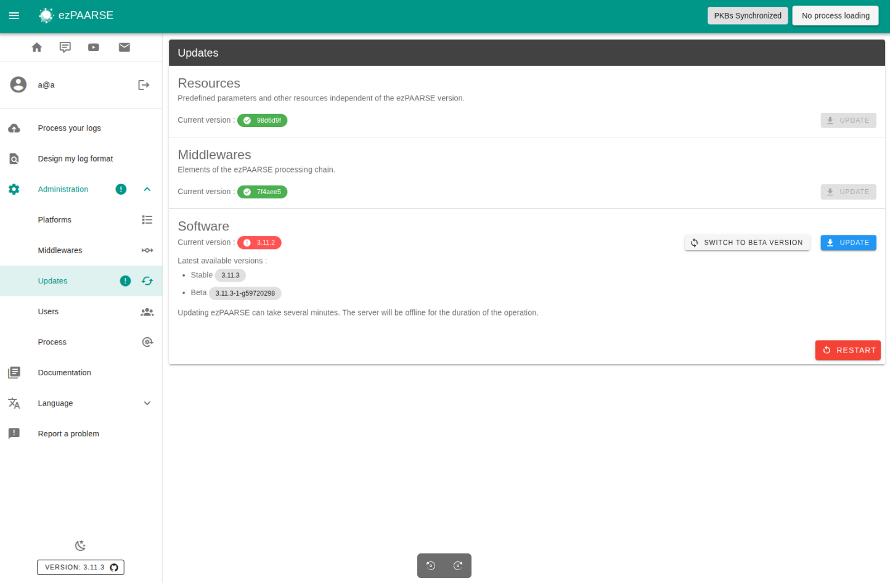
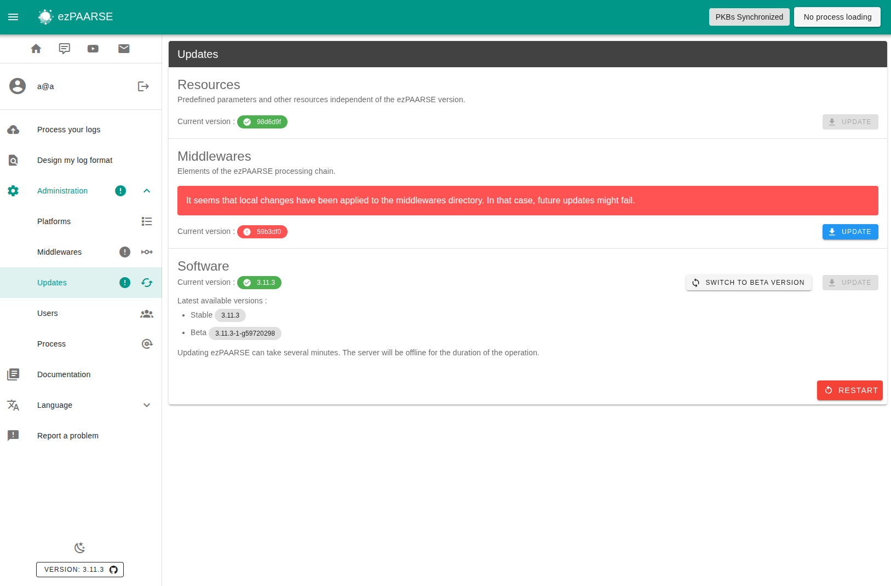
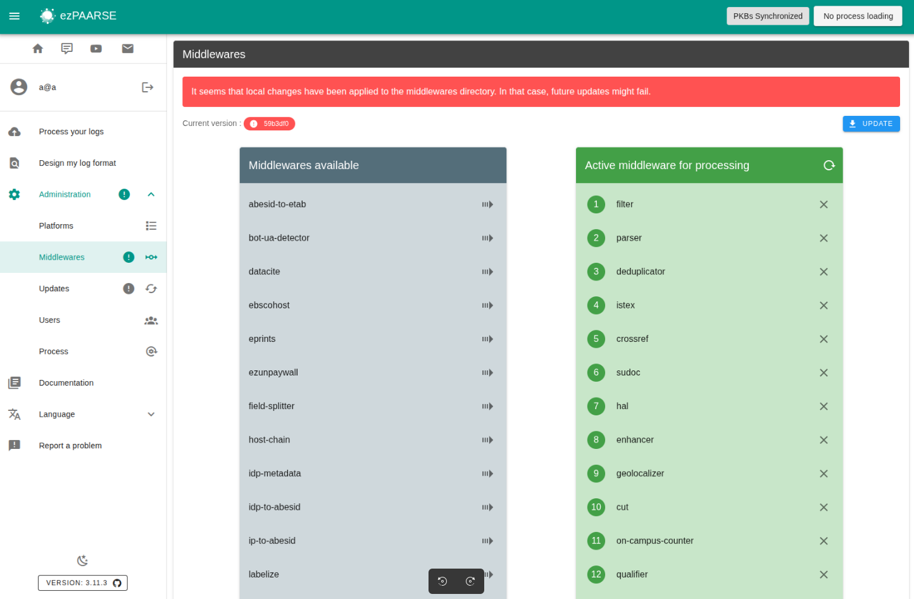
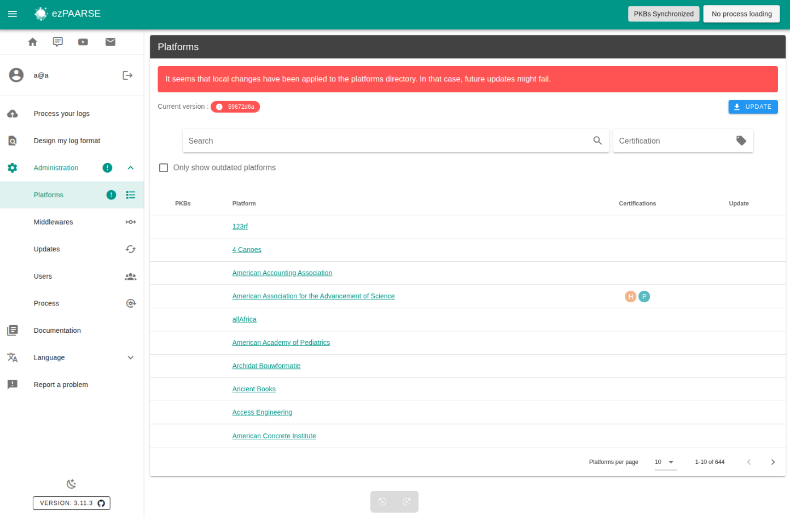
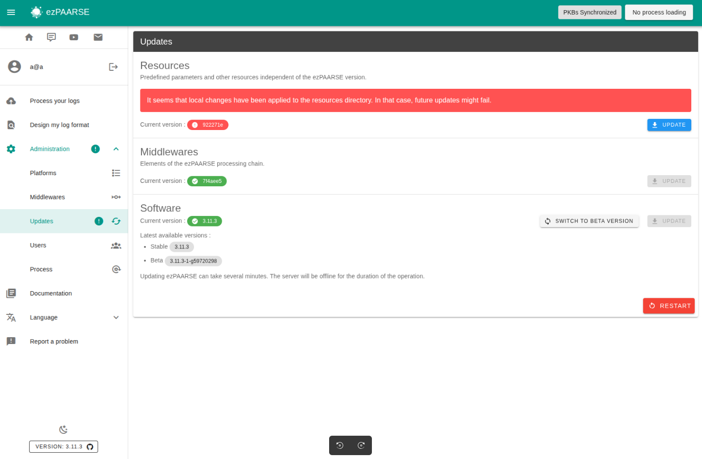
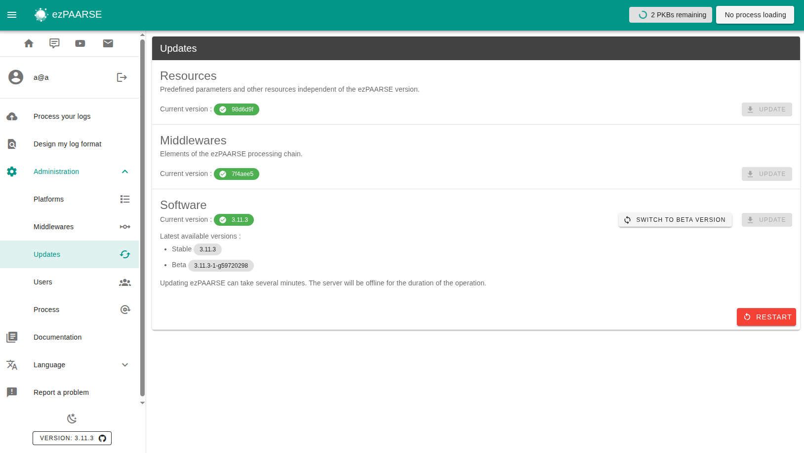

# Updates

Several components of ezPAARSE can be updated:

- the ezPAARSE core (new features, bug fixes, etc.)
- middlewares
- parsers
- resources
- exclusions

These updates can be performed either through the ezPAARSE administration interface or via the command line.

## Full update

### Web interface



After clicking the “Restart” button, ezPAARSE will restart.

⚠️ ezPAARSE may not restart; in that case, you will need to use the command line to restart it.

```bash
make start
```

### Command Line (CLI)

To update all components (core, middlewares, resources, platforms, exclusions), use the following commands.  
A restart of ezPAARSE is required for the changes to take effect.

```bash
# Update all components
make update

# Restart ezPAARSE
make restart
```

## Middlewares

### Web interface

You can update middlewars on 2 pages :

- on page /admin/update



- on page /admin/middlewares



After updating the middleware, you must restart the ezpaarse instance via the web interface or the command line.

### Command line (CLI)

You can update the middleware using **make** or **git**.

```bash
# in ezPAARSE forlder
make middlewares-update

# in middleware forlder
git pull
```

For the update to take effect, you must restart ezPAARSE.

```bash
make restart
```

## Platforms

### Web interface



After updating the platforms, you must restart the ezpaarse instance via the web interface or the command line.

### Command line (CLI)

You can update the platforms using **make** or **git**.

```bash
# in ezPAARSE forlder
make platforms-update

# in platforms forlder
git pull
```

For the update to take effect, you must restart ezPAARSE.

```bash
make restart
```

## Resources

### Web interface



After updating the resources, you must restart the ezpaarse instance via the web interface or the command line.

### Command line (CLI)

You can update the resources using **make** or **git**.

```bash
# in ezPAARSE forlder
make resources-update

# in resources forlder
git pull
```

For the update to take effect, you must restart ezPAARSE.

```bash
make restart
```

## Exclusions

### Command line (CLI)

You can update the exclusion using **make** or **git**.

```bash
# in ezPAARSE forlder
make exclusions-update

# in exclusion forlder
git pull
```

For the update to take effect, you must restart ezPAARSE.

```bash
make restart
```

## Restart ezPAARSE

### Web interface

You can restart ezPAARSE after any update. If a process is currently running, you will be notified before you can restart ezPAARSE. Please note that if you restart ezPAARSE while a process is running, that process will be canceled.



### Command line (CLI)

You can restart ezpaarse using **make**.

```bash
make restart
```
