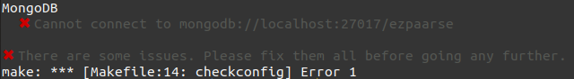
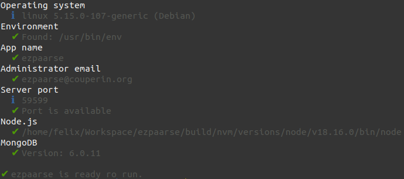

# Installation

Make sure you fulfilled the [requirements](./requirements.html) before going any further.

For an ezPAARSE installation on a **Windows** OS, you will have to use a dockerized container. Please see [below](install.html#docker-and-compose).

## ezPAARSE

### With source code

1. Clone the repository

```bash
git clone https://github.com/ezpaarse-project/ezpaarse
```

2. Open the ezPAARSE directory and get the latest stable version

```bash
cd ezpaarse
git checkout `git describe --tags --abbrev=0`
```

2. Use the command **make** to install.

This command will check whether your server has all the necessary prerequisites and download all dependencies and resources to enable ezPAARSE to work properly.

If you're planning to use ezPAARSE only from the command line and don't need the web interface, you can set the `EZPAARSE_NO_WEB_CLIENT` environment variable to prevent client side dependencies from being installed.

```bash
# Full setup
make

# Setup without web client
EZPAARSE_NO_WEB_CLIENT=1 make
```

> [!NOTE]  
> There may be an error saying that it is impossible to connect to mongodb. If there is only this error, it still means that ezPAARSE has been installed correctly, but that no mongoDB is installed.



At the end of the command, you should see this type of result.



### With docker

ezPAARSE is available as a [docker image](https://registry.hub.docker.com/r/ezpaarseproject/ezpaarse).

To run it with docker, you will need to install [Docker](https://docs.docker.com/engine/install/) and [Docker-Compose](https://docs.docker.com/compose/install/).

Then, you can either grab the `docker-compose.yml` file alone:
```bash
mkdir ezpaarse/
wget https://raw.githubusercontent.com/ezpaarse-project/ezpaarse/master/docker-compose.yml
test -f config.local.json || echo '{}' > config.local.json
```

or clone the github repository:
```bash
git clone https://github.com/ezpaarse-project/ezpaarse.git
cd ezpaarse
test -f config.local.json || echo '{}' > config.local.json
```

> [!NOTE]  
> If you install ezPAARSE with docker compose, there's no need to install mongodb in addition.

## MongoDB

ezPAARSE needs a mongodb to work, it can store the admin account, PKBs cache and processing history.
by default, 
ezPAARSE tries to connect to a mongodb which is available on port 27017.

> [!NOTE]  
> ezPAARSE loads PKBs on mongodb. As of mongodb version 6, this feature is no longer available.

### Official packages

You can install mongodb on your server via [official packages](https://www.mongodb.com/docs/manual/installation/).

### Docker

It's easier to install mongodb at the right version with docker.

```bash
# Create mongodb image.
# You can use other versions but this may have an impact on PKB.
docker run -p 27017:27017 --name ezpaarse-db -d mongo:3.6.23
# Start mongodb.
docker start ezpaarse-db
# Stop mongodb.
docker stop ezpaarse-db
```

